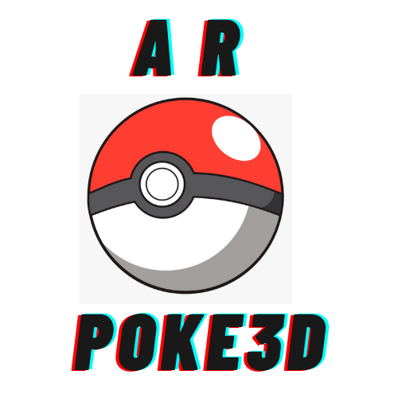

# Poke3D
An iOS app to make your love for Pokemon real.Which offers to make your pokemon cards live as if they were pokeballs.
Each card has its own pokemon stored in it as a picturised but what if you had the powers of god to make it real and enjoyable.
Don't worry now you do.Use our Poke3D and you're the god of pokemons.

# Features

- Make your pokemon stored in boring cards 3D.
- Just point the camera 📷 on the top of your card 
- And you're good to go
- Enjoy!

# App Icon

# App demo

 

 

 

 

# Video Demo

 

 

